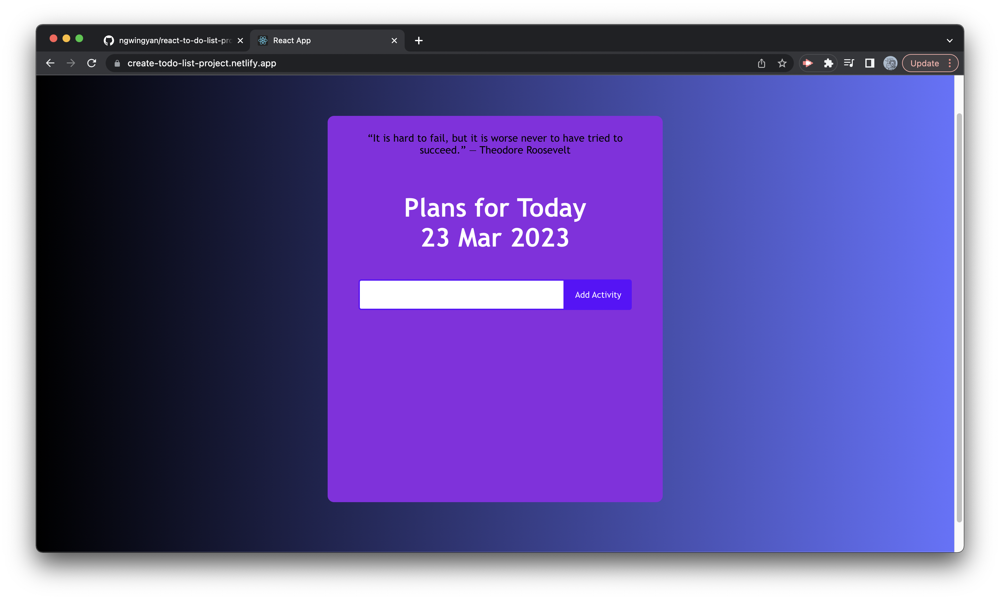
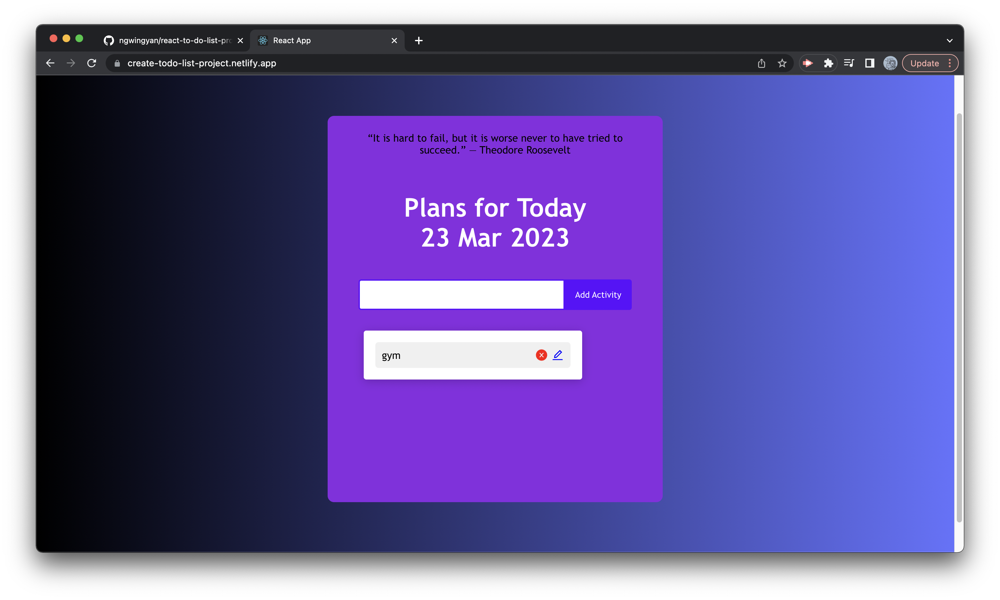
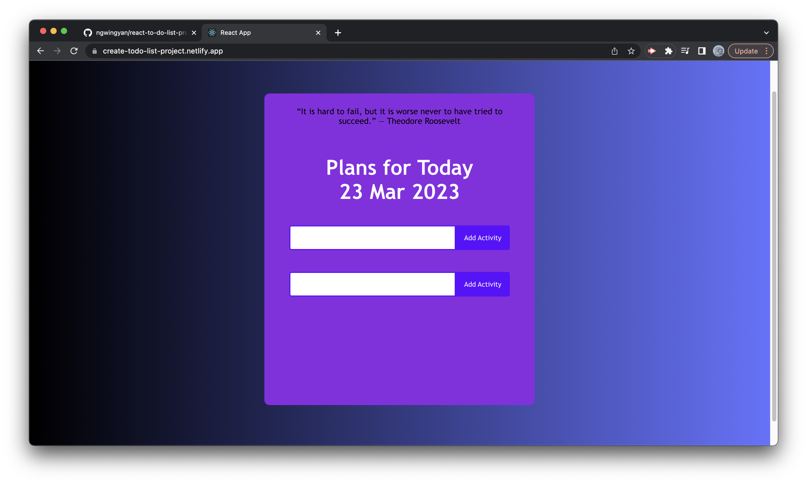

# To Do List App with REACT - taskMaster


## Description
Our goal was to develop a web application that enables our users to manage their daily tasks efficiently. The application was built using Node.js and React, and incorporated an API to 
provide users with inspirational quotes to help ease their minds. 

```

As a busy professional, I want to have a to-do list app that will allow 
me to keep track of my daily tasks and prioritize them based on their 
importance. 

I also want the app to provide me with an easy way to view all my tasks in one place, so that I can create new tasks quickly, assign 
due dates and reminders, and categorize them based on their type or 
urgency. 

Finally, I would appreciate some motivational quotes or inspirational messages to help me stay focused and motivated throughout the day.

```


## Feature and site preview

- On the initial page, it shows an inspirational quote from ZenQuote API and today's date from Worldtime API in UK format, and a text field to enter the task


- How it looks when an activity is added -


- When more tasks are added -


- When edit button is pressed -


- After editing the task - 


- After drag and drop tasks


- After deleting the task


## Usage
- Please refer to the ReactAppREADME.md on how to install the React App
- or you can view it on the Netlify website - https://create-todo-list-project.netlify.app/


## Technology used
React, Node.js, GET, Netlify, react-icons, react-dnd, zenquotes API, Worldtime API, 


## Future Development

* Ability to assign due dates and reminders
* Categorize them based on their type or urgency. 
* Mark completed tasks as done and provide a satisfying visual feedback.
* Integrate with calendar or send reminders for upcoming tasks via email or notifications on  mobile device.

## License
* 

## Link
* Repository URL - https://github.com/ngwingyan/react-to-do-list-project/
* Netlify site - https://create-todo-list-project.netlify.app/
